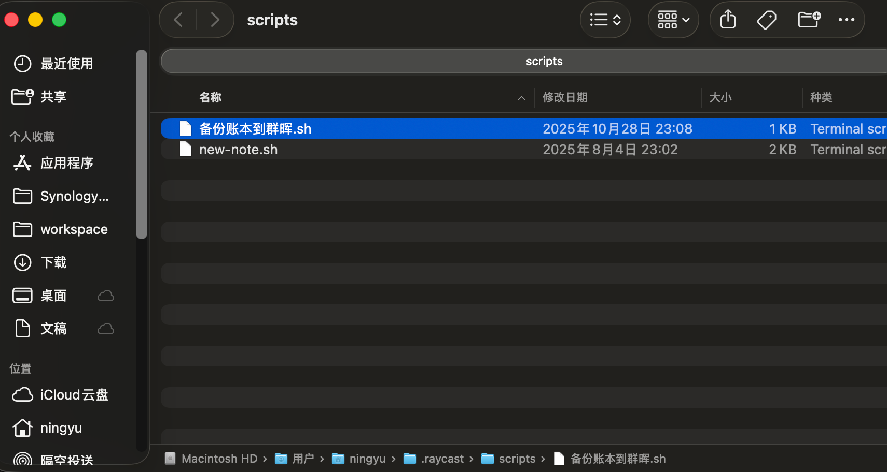
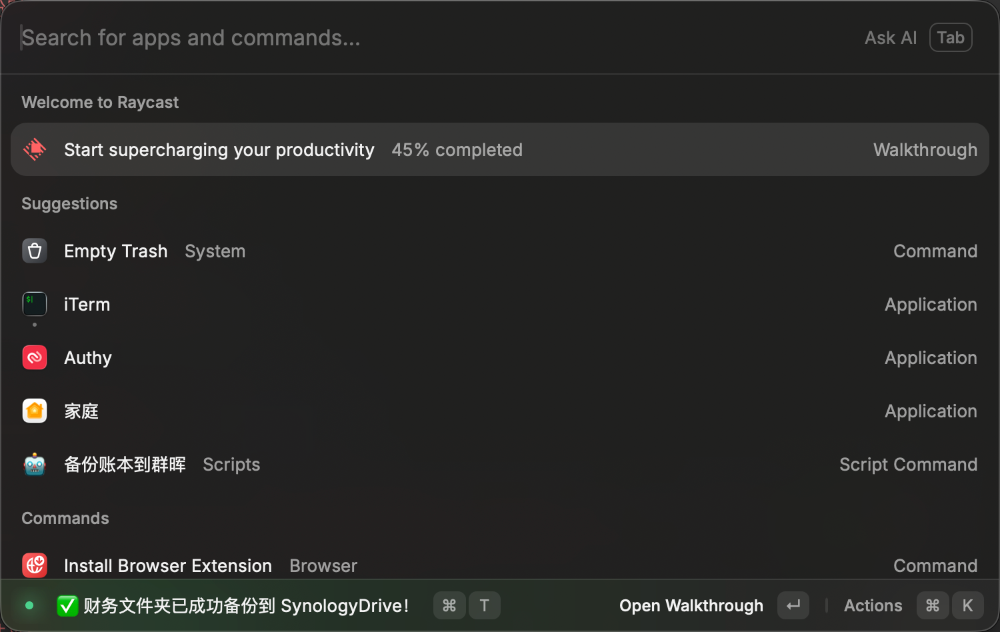

我习惯将一些小文件用iCloud进行同步/备份，这样在多个Apple设备上使用就很方便，虽然个人免费的空间只有5G，但是保存一些小文件已经足够了。例如，我平时将消费流水记账在iCloud云盘的`Numbers`文件中，相当地我有一个需求是可以手动备份它到群晖NAS中。

群晖的“文件服务”中自带有“rsyc”功能，但是需要需要将SSH加密端暴露出去，顾及安全问题，最终还是放弃了这个方案。转而思考能不能用我自己的MacBook电脑作为受信的终端，通过它来触发备份，因为这台电脑上有群晖的Drive同步任务常驻的。iPhone等其它Apple设备都通过iCloud来保持文件同步，然后在需要备份时，通过MBA上的`rsync`将文件同步到群晖的同步盘。

实现步骤：

1. 在MBA上，启动`Synology Drive Client`，并新建双向同步任务

   

   

2. 呼出Raycat，输入“script”，点击“Create Script Command”

   

   

3. 填写脚本命令的标题和描述后，点击“Create Script”

   

   

4. 将脚本保存在个人用户目录中的.raycast/scripts目录中

   

   

5. 填入下面的脚本内容，只需要修改`SOURCE`变量为iCloud云盘中来源文件的路径（右键选中iCloud云盘中的源目录，按住`Option`键，选中“将XX拷贝为路径名称”）、`DEST`变量为群晖同步任务的目标文件的路径

   ```bash
   #!/bin/bash
   
   # Required parameters:
   # @raycast.schemaVersion 1
   # @raycast.title 备份账本到群晖
   # @raycast.mode compact
   
   # Optional parameters:
   # @raycast.icon 🤖
   
   # Documentation:
   # @raycast.description 将 iCloud 财务同步到 Synology Drive
   # @raycast.author TONY
   
   set -e  # 遇错即停
   
   SOURCE="/Users/ningyu/Library/Mobile Documents/com~apple~CloudDocs/财务"
   DEST="/Users/ningyu/SynologyDrive/财务"
   LOGFILE="$HOME/Library/Logs/finance-backup.log"
   
   # 确保目标目录存在
   mkdir -p "$DEST"
   
   # 开始备份
   echo "🚀 开始备份财务文件夹..."
   echo "源目录: $SOURCE"
   echo "目标目录: $DEST"
   
   # 执行 rsync（静默模式，只输出关键信息）
   rsync -av --delete \
         --exclude=".DS_Store" \
         --exclude="._*" \
         --exclude=".TemporaryItems" \
         "$SOURCE/" "$DEST/" > /dev/null
   
   # 记录日志
   echo "$(date): 财务备份成功完成。" >> "$LOGFILE"
   
   # 发送 macOS 通知
   osascript -e "display notification \"财务文件夹已成功备份到 SynologyDrive！\" with title \"✅ 财务备份\" sound name \"Hero\""
   
   echo "✅ 财务文件夹已成功备份到 SynologyDrive！"
   ```

   

6. 保存后，再次呼出Raycast，输入“备份账本到群晖”（实际只需要输入前1、2个字符就行，比如“备”或“备份”）

   


附：在 macOS 上，`rsync`通常**已经预装**，因为它是 Unix-like 系统中常用的文件同步工具，可以通过`rsync --version`查看版本，如果太旧了，可以通过`Homebrew`安装新版:

```bash
/bin/bash -c "$(curl -fsSL https://raw.githubusercontent.com/Homebrew/install/HEAD/install.sh)"

brew install rsync
```

