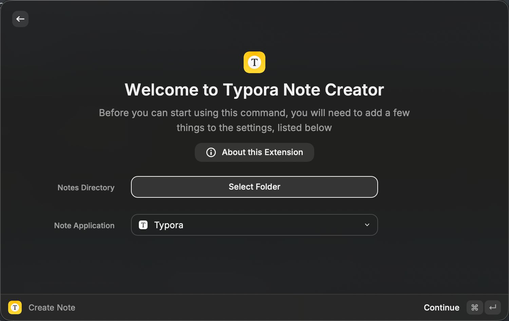

先放地址：https://www.raycast.com/mynameisny/typora-note-creator

这是我的第一个Raycast插件，创建它的初衷是因为我的笔记整理风格是为每篇笔记创建一个独立的文件夹，在该文件夹中存放该笔记的 Markdown 文件以及它引用的所有素材。

```
notes-root/
├── My New Note/
│   ├── My New Note.md      # or index.md
│   └── image.png
├── Another Note/
│   ├── Another Note.md
│   └── diagram.svg
```


与将所有笔记素材混杂存放在一个公共目录中的方式相比，这种结构的最大优点在于：当需要删除某篇笔记时，只需删除对应的文件夹即可，无需从大量素材中手动筛选和清理。这样不仅简洁，也大大降低了误删或漏删的风险。

按照这样的组织方式，我在每次写新笔记时，都需要重复以下繁琐步骤：

1. 手动新建文件夹；
2. 将其重命名为笔记标题；
3. 创建 Markdown 文件；
4. 将 Markdown 文件重命名为笔记标题。

这个过程显然低效且容易出错。


Obsidian 上有现成的插件可以实现这一自动化流程，比如 [folder-notes](https://github.com/LostPaul/obsidian-folder-notes)。但由于 Typora 不支持插件机制，我考虑使用 Raycast 插件/扩展来实现类似的功能。

最终我的扩展实现的功能特性如下：

- **可配置的笔记根目录**：用户可以指定所有笔记的统一存储位置；
- **模板支持**：创建新笔记时可选择预设的模板作为内容初始结构（比如可以将Hugo或Hexo等的Front matter添加元数据到博客文档）；
- **可配置的文件命名规则**：可选择将 Markdown 文件命名为与文件夹同名，或使用固定名称（如 `index.md`，以便于 Hugo 等博客工具的集成）。

Raycast的扩展开发难度不高，官方的[开发者文档](https://developers.raycast.com/)非常详细，UI、函数、工具等都是高度规范化的，只需要照着它们的API Reference文档学着写就行，难点是Code Review过程，提交PR之后，会通过邮件和Raycast社区和官方的不同的评审人员进行多次交流。


欢迎试用，扩展源码：https://github.com/mynameisny/typora-note-creator
