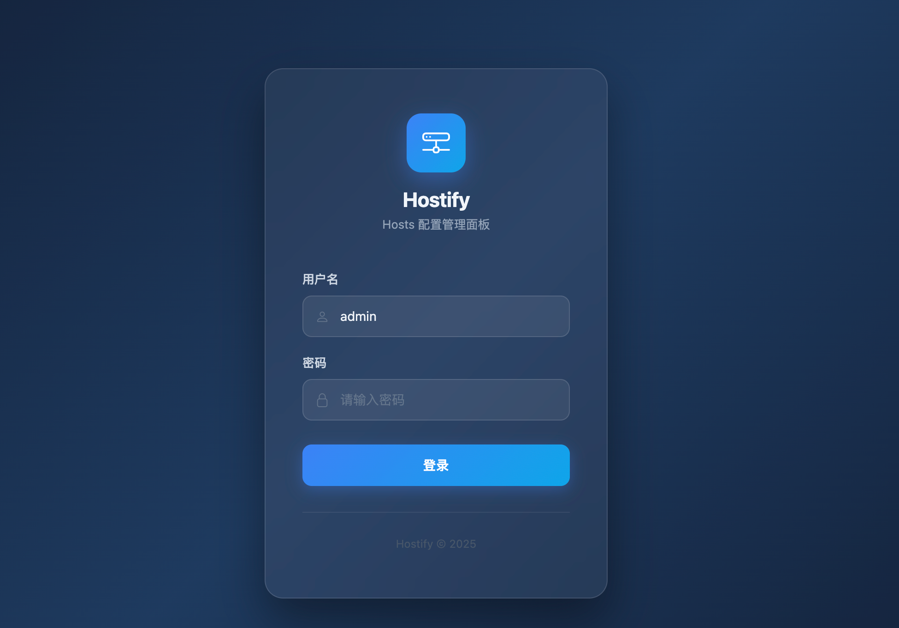
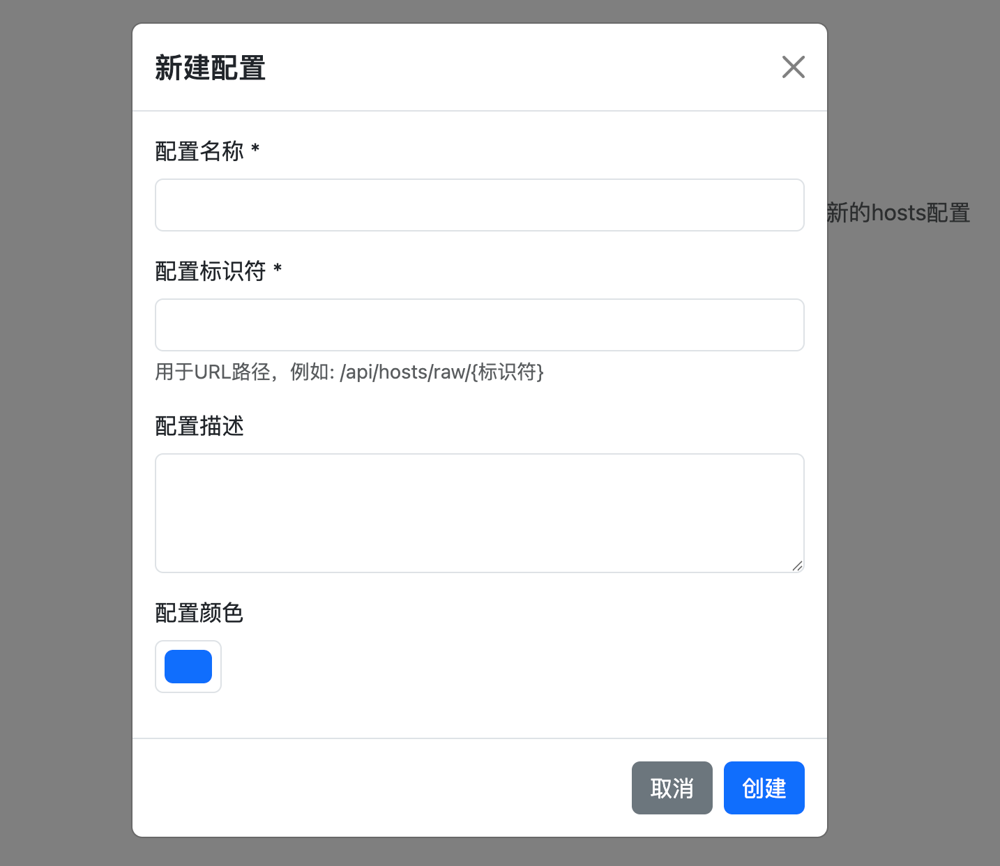
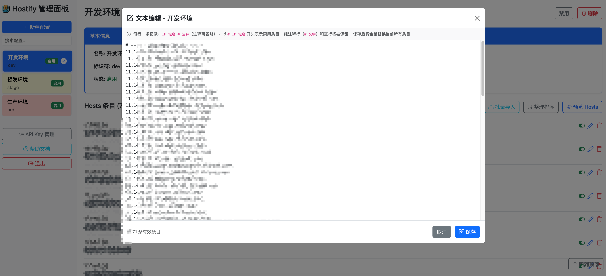
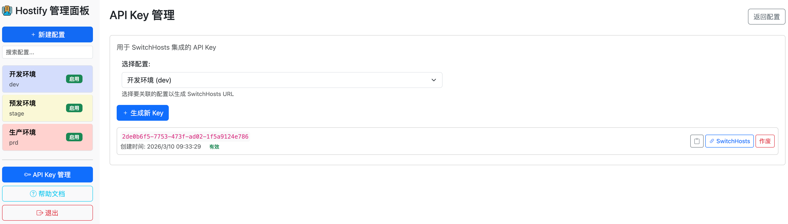
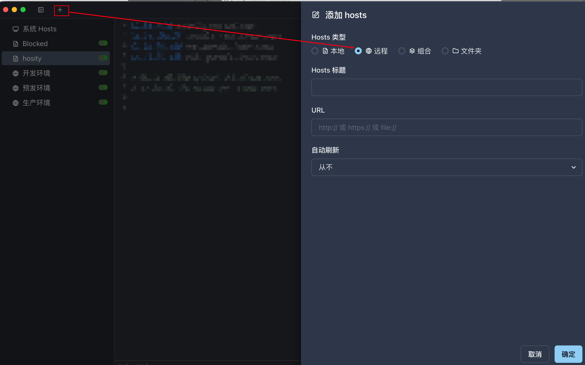

# SwitchHosts 与 Hostify：高效管理 Hosts 文件的完美组合

>  在日常的软件开发和网络调试中，Hosts 文件扮演着至关重要的角色。无论是本地开发环境的域名映射、测试不同服务器的响应，还是绕过 DNS 缓存进行快速切换，Hosts 文件都是开发者不可或缺的工具。然而，传统的 Hosts 文件管理方式存在诸多痛点：手动编辑容易出错、多环境切换繁琐、团队协作困难等。
>
>  本文将介绍如何通过 SwitchHosts 和 Hostify 的完美组合，彻底解决这些痛点，实现 Hosts 文件的直观、动态化管理。

 

## SwitchHosts：本地 Hosts 管理利器

[SwitchHosts](https://switchhosts.app/zh) 是一个管理、切换多个 hosts 方案的工具，支持 Windows、macOS 和 Linux 平台。它提供了图形化界面，让用户可以轻松地创建、编辑、切换不同的 Hosts 配置。

 

### 核心特性

- 多配置管理：可以创建多个 Hosts 配置文件，每个配置对应不同的开发环境或测试场景
- 一键切换：通过简单的点击操作即可在不同配置间快速切换
- 自动备份：每次修改都会自动备份原始 Hosts 文件，确保安全
- 语法高亮：提供代码编辑器般的体验，支持语法高亮和行号显示
- 远程同步：支持从远程 URL 同步 Hosts 配置，实现团队共享

 

### 场景示例

- 前端开发：在本地开发、测试环境、预发布环境之间快速切换
- 后端调试：将特定域名指向不同的后端服务实例
- 网络测试：模拟不同的网络环境和 DNS 解析结果
- 安全测试：临时屏蔽某些域名或重定向到安全地址

 

## Hostify：动态 Hosts 管理平台

[Hostify](https://github.com/mynameisny/hostify) 是我自己开发的一个基于 Spring Web 的动态 Hosts 管理平台，它将 Hosts 配置存储在数据库中，并提供 RESTful API 接口供外部工具（如 SwitchHosts）调用。支持完整的 CRUD 操作，包括批量导入、文本编辑、配置预览等功能。 

### 核心特性

1. 完整的 Hosts 行类型支持：支持三种 Hosts 行类型

   > 这种设计确保了 Hosts 文件的完整性和可读性，同时在 UI 中只显示普通条目，避免界面混乱。

   - 普通条目 (NORMAL)：标准的 IP 域名 格式，用于正常的域名映射
   - 注释行 (COMMENT)：以 # 开头的注释行，用于说明和分组
   - 空行 (BLANK)：空白行，用于提高可读性和组织结构

   

2. 多配置管理

   - 配置分组：每个配置可以包含多个 Hosts 条目，支持启用/禁用状态
   - 颜色标识：为不同配置设置颜色标识，便于快速识别
   - 排序功能：支持自定义条目排序，保持逻辑顺序

   

3. 批量操作支持

   - 批量导入：支持从 Hosts 文件或 JSON 格式批量导入条目

   - 冲突处理：提供跳过、覆盖、终止三种冲突处理策略

   - 文本编辑：支持全量文本编辑，保留原有格式和注释

     

4. Hostify 支持基于 API Key 的权限控制

   - 可以在Hostify管理页面中失效某个不信任的Token

 

### 场景示例

- 在 Hostify 中创建 "团队开发环境" 配置

  团队成员在 SwitchHosts 中添加该远程源，当配置更新时，所有成员的 SwitchHosts 会自动同步

  

- 多环境快速切换

  在 Hostify 中创建多个配置： dev 、 test 、 staging，在 SwitchHosts 中分别添加这些远程源，通过 SwitchHosts 的快捷键或托盘菜单一键切换

  

- 临时调试配置

  开发者需要在开发、测试、预发布等多个环境间频繁切换。

 

### 使用方法

1. 在 Hostify 中创建配置

   - 登录 Hostify 管理界面

     

   

   - 创建新的 Hosts 配置（如 "开发环境"、"测试环境"）

     

     

   - 添加 Hosts 条目，支持注释和空行

     

     

   - 生成 API Key 用于 SwitchHosts 集成

     为了避免非认证访问，可以为不同用户生成不同Key，当其不受信任时，删除即可

     

   - 先选中要使用哪个配置，然后点击“SwitchHosts”按钮来复制链接

     

     
   
   - 在 SwitchHosts 中配置远程源
   
     - 点击 "+" 添加新配置，
   
     - 选择 "Remote" 类型
     - 输入 Hostify 提供的 URL 格式：
       http://your-hostify-server/api/hosts/raw/{config-key}?apiKey=YOUR_API_KEY
       设置自动刷新间隔（如 5 分钟）
   
     

 

### 常见问题

> Hostify 项目持续更新中，建议关注官方仓库获取最新功能和安全更新。同时，SwitchHosts 也定期发布新版本，建议保持工具更新以获得最佳体验。

- Q：是否支持版本控制

  A：暂不支持。虽然 Hostify 本身不直接提供版本控制，但可以通过以下方式实现：

  - 定期导出 Hosts 配置作为备份，结合 Git 等版本控制系统管理配置变更
  - 利用数据库的审计日志追踪配置修改历史

- Q：是否支持多租户

  A：暂不支持。主要是懒，表结构里没有存tenantId，加完之后，还得有对应的租户管理的API和页面，最近没有精力搞。建议创建配置时，将按公司、部门、项目、环境这样组织配置
