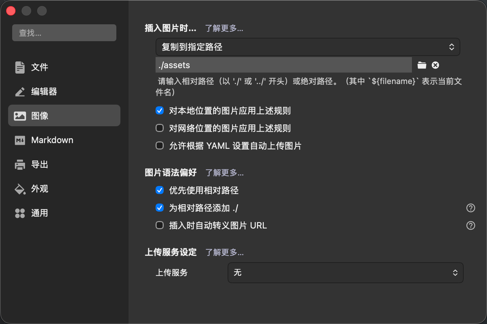

## 预定义模板

Archetypes是Hugo提供的内容模板系统，它允许开发者为不同类型的内容定义标准化的Front-Matter和内容结构。当使用`hugo new`命令创建新内容时，系统会自动应用对应的原型模板，生成包含预定义元数据的Markdown文件。

在Hugo博客的根目录中的archetypes/post目录中，新建一个`index.md`文件，内容如下，这样每次新建博客时都会自动带有这些页面的元数据。

```
---
title: "{{ replace .Name "-" " " | title }}"
description: "{{ .Name }}"
keywords: "{{replace .Name "-" ","}}"

date: {{ .Date }}
lastmod: {{ .Date }}

categories:
 -
tags:
  -
  -

# Post's origin author name
#author:
# Post's origin link URL
#link:
# Image source link that will use in open graph and twitter card
#imgs:
# Expand content on the home page
#expand: true
# It's means that will redirecting to external links
#extlink:
# Disabled comment plugins in this post
#comment:
# enable: false
# Disable table of content int this post
# Notice: By default will automatic build table of content 
# with h2-h4 title in post and without other settings
#toc: false
# Absolute link for visit
#url: "{{ lower .Name }}.html"
# Sticky post set-top in home page and the smaller number will more forward.
#weight: 1
# Support Math Formulas render, options: mathjax, katex
#math: mathjax
---

```

<br>

<br>


## 新建文章

Hugo有一个[Page bundles](https://gohugo.io/content-management/page-bundles/)的概念，简单说就是将每篇文章及其相关的所有关资源的都放在同一个目录中。类似下面这个`about`目录，代表的就是一篇独立的文章，它的文章内容Markdown文件和引用的图片、资源都放在这个目录中：

```
content/
├── about/
│   ├── index.md
│   └── welcome.jpg
└── privacy.md
```


基于这样的组织方式，在Hugo根目录下，使用下面的命令来新建一篇文章：

```
hugo new post/"使用Hugo来记录博客"
```


说明：

1. 路径“post/”不能少，创建成功后的文章会放在”content/post”目录中
2. 当标题中有空格或符号的时候需要使用双引号


## Typora配置

我习惯用Typora作为Markdown编辑器，先设置将图片保存当前文章的目录下的`assets`目录中，并勾选“优先使用相对路径”




------


## 部署发布

本地先通过`hugo server -D`验证没问题之后，再将Hugo博客的代码提交到GitHub，自动触发GitHub Actions将构建好的Hugo静态文件同步到VPS中的Nginx Web目录。

参见：<a href="https://note.ningyu.me/post/%E9%80%9A%E8%BF%87github-actions%E8%87%AA%E5%8A%A8%E9%83%A8%E7%BD%B2hugo%E5%8D%9A%E5%AE%A2%E5%88%B0vps/#more">通过GitHub Actions自动部署Hugo博客到VPS - 熟人介绍的</a>


## 注意事项

### 找不到图片

- Linux VPS的文件系统是`ext4`，是严格区分大小写的，而MacOS上默认的`APFS`不区分大小写，可能出现下面这种情况，明明在MAC上预览是正常的，但是部署到VPS上之后，图片都找不到了，即：URL 中的路径名 ≠ Hugo 实际生成到磁盘上的目录名。

  Hugo 在生成站点时，会把「页面 URL / 目录名」做 `urlize` 处理（默认小写），但 `.assets` 目录是“原样拷贝”，不会参与这个过程

  举例来说：在磁盘上有一个“Raycast同步iCloud的文件到群晖.md”文件和一个“Raycast同步iCloud的文件到群晖.assets”目录（图片都放在这里）

  以这篇文章为例：

  

  源文件名（content 里）

  ```
  Raycast同步iCloud的文件到群晖.md
  ```

  👉 **大小写保留**（macOS 上看起来一切正常）

  ------

  

  Hugo 生成的「页面 URL / 目录名」

  在 `public/post/` 下，你看到的是：

  ```
  raycast同步icloud的文件到群晖/
  ```

  这是 Hugo 做的事：

  - 自动 `urlize`
  - 默认：
    - 转小写
    - 去掉特殊字符
    - 做 URL 安全处理

  📌 这是 **Hugo 的默认行为**，并不是配置问题。

  ------

  

  `.assets` 目录（图片所在的地方）

  ```
  Raycast同步iCloud的文件到群晖.assets/
  ```

  - 在写 Markdown 时的图片路径决定
  - Hugo **不会改名**
  - **完全原样复制**

  ------

  

  **那么“结构性根因”是什么？**

  现在的发布结构本质是：

  ```
  public/post/
  ├── raycast同步icloud的文件到群晖/        ← Hugo URL 目录（自动小写）
  └── Raycast同步iCloud的文件到群晖.assets/ ← 原样 assets（大小写保留）
  ```

  而在 HTML 里引用的是：

  ```
  
  ```

  在 **Linux** 上严格区分大小写：

  - `raycast` ≠ `Raycast`
  - `icloud` ≠ `iCloud`

  路径不可能匹配 → 404

  ------

  

  **为什么在本地看不出来问题？**

  这是一个非常典型的“跨平台错觉”：macOS（默认 APFS）

  - 大小写不敏感
  - `A.png` 和 `a.png` 是同一个文件
  - 所以在本地：
    - `hugo server` ✅
    - 浏览器访问 ✅

  ------

  

  **Linux（ext4 / xfs）**

  - 严格区分大小写
  - 路径必须 100% 一致
  - 所以一上线：
    - 图片全挂 ❌

  

  这不是 Hugo 特有的问题，而是所有静态站点都会踩的坑，正确的解决办法，也是根治办法就是使用：Page Bundle，这也是我为什么一开始就按这样的方式组织的原因：让Hugo自动处理路径；不存在大小写不一致；极其适合 Obsidian / Typora 的“一文一目录”。
