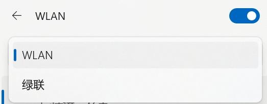
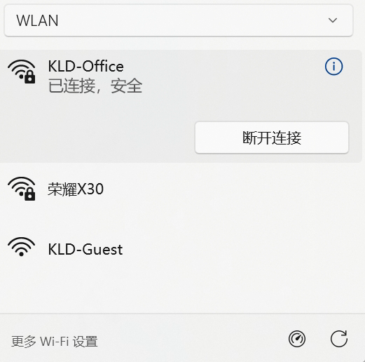
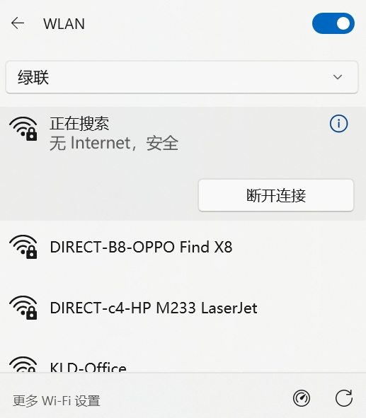
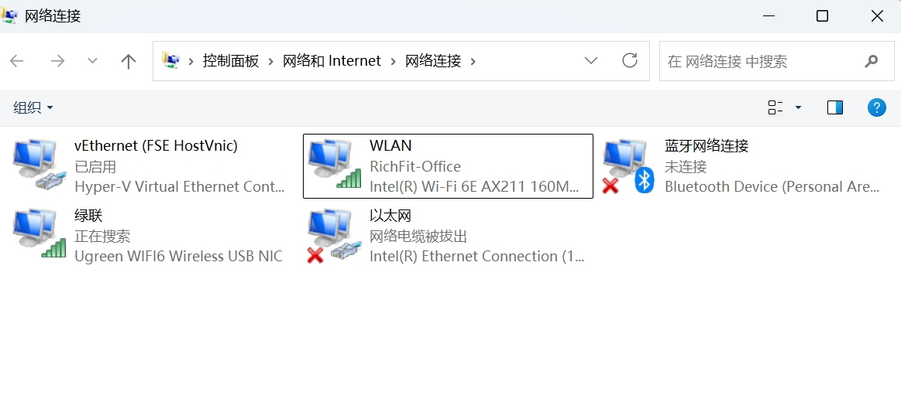

> 文中所有的命令必须以**管理员身份**打开CMD或PowerShell执行，确保有足够的权限。

<br>

### 连接Wi-Fi

在任务栏点击Wi-Fi图标，将2个无线网卡，分别连接不同Wi-Fi网络：








<br>

打开“网络连接”（可使用`ncpa.cpl`命令），查看IP地址分配情况：

笔记本自带无线网卡连接内网，通过DHCP获得的IP地址、子网掩码和网关：

```
IPv4 Address. . . . . . . . . . . : 11.2.14.157
   Subnet Mask . . . . . . . . . . . : 255.255.254.0
   Default Gateway . . . . . . . . . : 11.2.14.1
```


绿联无线网卡连接外网，通过DHCP获得的IP地址、子网掩码和网关：

```
IPv4 Address. . . . . . . . . . . : 192.168.66.79
   Subnet Mask . . . . . . . . . . . : 255.255.255.0
   Default Gateway . . . . . . . . . : 192.168.66.1
```


通过route命令`route print -4`，查看网卡的编号：**16**是机器网卡、**2**是绿联网卡

```bash
C:\Users\ningyu>route print -4
===========================================================================
Interface List
  4...9c 2d cd e1 5d 05 ......Intel(R) Ethernet Connection (16) I219-V
  2...6c 1f f7 50 f3 a0 ......Ugreen WIFI6 Wireless USB NIC
 11...28 6b 35 b0 f9 f6 ......Microsoft Wi-Fi Direct Virtual Adapter
 19...2a 6b 35 b0 f9 f5 ......Microsoft Wi-Fi Direct Virtual Adapter #2
 10...6c 1f f7 50 f3 a1 ......Microsoft Hosted Network Virtual Adapter
 16...28 6b 35 b0 f9 f5 ......Intel(R) Wi-Fi 6E AX211 160MHz
  9...28 6b 35 b0 f9 f9 ......Bluetooth Device (Personal Area Network)
  1...........................Software Loopback Interface 1
===========================================================================
```

<br>

<br>

### 删除内网的默认网关

> 确保默认网关不是内网网关

```bash
# 删除指向11.2.14.1的默认路由
route delete 0.0.0.0 mask 0.0.0.0 11.2.14.1

# 验证：查看默认路由是否只剩绿联网关
route print -4 | findstr "0.0.0.0"
```

<br>

<br>

### 添加内网网段路由

> 确保内网可访问

```bash
# 设置访问10.*网段和11.*网段都走内网的网关11.2.14.1，if参数16就是上面查询出的笔记本自带网的编号
route add 10.0.0.0 mask 255.0.0.0 11.2.14.1 metric 50 if 16
route add 11.0.0.0 mask 255.0.0.0 11.2.14.1 metric 50 if 16
```

<br>

<br>

### 处理DHCP分配的默认网关冲突

由于我们的两个网卡都是通过DHCP获取的默认网关（且内网是通过专门的网络安全工具进行连接，只能DHCP无法手工配置），虽然我通过`route delete`命令手动删除了内网的默认网关，一旦DHCP续租，Windows会重新把 11.2.14.1 加回默认路由，导致路由冲突。

最稳定的做法是修改网卡接口跃点数，彻底解决DHCP覆盖问题：Windows会自动根据该值计算路由优先级，且配置永久保存、不受DHCP影响。

```cmd
:: 绿联USB网卡（索引2）设为高优先级（数值小优先）
netsh interface ipv4 set interface 2 metric=10

:: 自带Intel网卡（索引16）设为低优先级
netsh interface ipv4 set interface 16 metric=50
```

 

原理：设置后，系统会自动将两条默认路由的 Metric 分别调整为10 和50。Windows 始终优先使用 Metric 小的路由走外网（数越小，优先级越高），内网流量因存在 On-link 直连路由，天然走自带网卡，无需额外添加静态路由。

```bash
C:\Users\ningyu>route print -4
===========================================================================
Interface List
  4...9c 2d cd e1 5d 05 ......Intel(R) Ethernet Connection (16) I219-V
  2...6c 1f f7 50 f3 a0 ......Ugreen WIFI6 Wireless USB NIC
 11...28 6b 35 b0 f9 f6 ......Microsoft Wi-Fi Direct Virtual Adapter
 19...2a 6b 35 b0 f9 f5 ......Microsoft Wi-Fi Direct Virtual Adapter #2
 10...6c 1f f7 50 f3 a1 ......Microsoft Hosted Network Virtual Adapter
 16...28 6b 35 b0 f9 f5 ......Intel(R) Wi-Fi 6E AX211 160MHz
  9...28 6b 35 b0 f9 f9 ......Bluetooth Device (Personal Area Network)
  1...........................Software Loopback Interface 1
===========================================================================

IPv4 Route Table
===========================================================================
Active Routes:
Network Destination        Netmask          Gateway       Interface  Metric
          0.0.0.0          0.0.0.0     192.168.66.1    192.168.66.79     10
          0.0.0.0          0.0.0.0        11.2.14.1      11.2.14.157     50 (即使又重新加回来了，但它的优先级也比10要低，无法作为默认路由)
         10.0.0.0        255.0.0.0        11.2.14.1      11.2.14.157     60
         11.0.0.0        255.0.0.0        11.2.14.1      11.2.14.157     60
        11.2.14.0    255.255.254.0         On-link       11.2.14.157    306
      11.2.14.157  255.255.255.255         On-link       11.2.14.157    306
      11.2.15.255  255.255.255.255         On-link       11.2.14.157    306
        127.0.0.0        255.0.0.0         On-link         127.0.0.1    331
        127.0.0.1  255.255.255.255         On-link         127.0.0.1    331
  127.255.255.255  255.255.255.255         On-link         127.0.0.1    331
     192.168.66.0    255.255.255.0         On-link     192.168.66.79    266
    192.168.66.79  255.255.255.255         On-link     192.168.66.79    266
   192.168.66.255  255.255.255.255         On-link     192.168.66.79    266
        224.0.0.0        240.0.0.0         On-link         127.0.0.1    331
        224.0.0.0        240.0.0.0         On-link     192.168.66.79    266
        224.0.0.0        240.0.0.0         On-link       11.2.14.157    306
  255.255.255.255  255.255.255.255         On-link         127.0.0.1    331
  255.255.255.255  255.255.255.255         On-link     192.168.66.79    266
  255.255.255.255  255.255.255.255         On-link       11.2.14.157    306
===========================================================================
Persistent Routes:
  None
```

<br>

<br>

### Windows CMD脚本

> 保存为config_route.bat，右键以管理员身份运行

```
@echo off
setlocal enabledelayedexpansion
chcp 65001 >nul 2>nul

echo ════════════════════════════════════════════════
echo   🔄 内外网路由配置脚本 (CMD版)
echo   ⚠️  必须以【管理员身份】运行！
echo ════════════════════════════════════════════════
echo.

:: ── 检查管理员权限 ──────────────────────────────
net session >nul 2>&1
if %errorlevel% neq 0 (
    echo [错误] 请右键脚本 → 选择【以管理员身份运行】
    pause & exit /b 1
)

:: ── 步骤1: 删除默认路由 ─────────────────────────
echo [1/5] 删除默认路由 0.0.0.0/0 ...
route delete 0.0.0.0 mask 0.0.0.0 11.2.14.1 >nul 2>&1
echo     ✅ 执行完成
echo.

:: ── 步骤2: 获取网卡接口编号 (安全解析) ───────────
echo [2/5] 自动识别 Intel AX211 接口编号...
set "IF_NUM="

for /f "tokens=1 delims=." %%A in ('route print -4 ^| find /i "AX211"') do (
    if "!IF_NUM!"=="" set "IF_NUM=%%A"
)

if "!IF_NUM!"=="" (
    echo     ⚠️  未自动匹配到 AX211，请查看下方列表:
    route print -4 | find /i "Wi-Fi"
    echo.
    set /p "IF_NUM=请手动输入接口编号(如 15): "
    if "!IF_NUM!"=="" (
        echo [错误] 未输入编号，脚本终止
        exit /b 1
    )
)
echo     ✅ 接口编号: !IF_NUM!
echo.

:: ── 步骤3: 添加 10.0.0.0/8 路由 ──────────────────
echo [3/5] 配置 10.0.0.0/8 路由...
route delete 10.0.0.0 mask 255.0.0.0 >nul 2>&1
route add 10.0.0.0 mask 255.0.0.0 11.2.14.1 metric 10 if !IF_NUM! >nul 2>&1
if !errorlevel! equ 0 (echo     ✅ 路由添加成功) else (echo     ❌ 添加失败，错误码 !errorlevel!)
echo.

:: ── 步骤4: 添加 11.0.0.0/8 路由 ──────────────────
echo [4/5] 配置 11.0.0.0/8 路由...
route delete 11.0.0.0 mask 255.0.0.0 >nul 2>&1
route add 11.0.0.0 mask 255.0.0.0 11.2.14.1 metric 10 if !IF_NUM! >nul 2>&1
if !errorlevel! equ 0 (echo     ✅ 路由添加成功) else (echo     ❌ 添加失败，错误码 !errorlevel!)
echo.

:: ── 步骤5: 验证网络连通性 ───────────────────────
echo [5/5] 验证访问 www.portal.dcloud.cnpc ...
curl -s -m 10 -I http://www.portal.dcloud.cnpc >nul 2>&1
if !errorlevel! equ 0 (
    echo     🎉 验证成功！内外网路由已生效
) else (
    echo     ⚠️  直接访问失败，尝试基础连通性测试:
    ping -n 1 www.portal.dcloud.cnpc
)

echo.
echo ════════════════════════════════════════════════
echo   📋 当前生效的关键路由:
:: ✅ 修复点：改为匹配【目标网段 + 网关】，避开接口编号显示差异
route print -4 | findstr /C:"10.0.0.0" /C:"11.0.0.0" | findstr /C:"11.2.14.1"
if !errorlevel! neq 0 echo     (未找到对应路由，请手动执行 route print -4 检查)
echo ════════════════════════════════════════════════
echo.
echo 💡 提示:
echo   • 重启后失效？将 route add 改为 route add -p 可永久生效
echo   • 恢复默认：route delete 10.0.0.0 mask 255.0.0.0
echo   • 恢复默认：route delete 11.0.0.0 mask 255.0.0.0
echo.
pause
```


