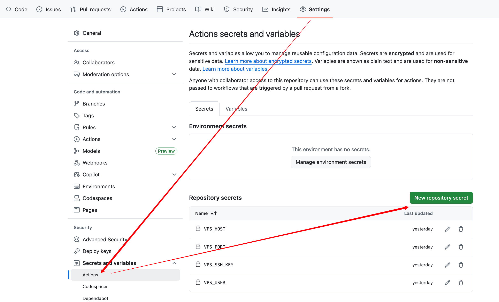
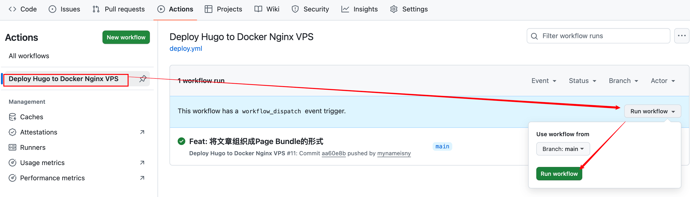

我的博客基于Hugo搭建，源码都保存在GitHub，通过GitHub Actions，在收到main分支变化事件时，自动构建Hugo源码，生成可部署的分发文件，部署到我远程VPS的Nginx Web目录（Nginx是Docker容器方式运行）。

核心原则就是将Hugo 生成的 public/ 目录 → 同步到宿主机目录 → 挂载进 Nginx 容器。

Nginx容器根本不用重启（除非改了配置时），下面是具体的步驟：


### Nginx

VPS：

```
/home/nginx
├── html/        # Hugo public/ 同步到这里
└── conf/
    └── nginx.conf
    └── conf.d
          └── default.conf
    			└── ssl
    						└── dhparam.pem
    						└── ningyu.key
    						└── hparam.pem
```


Docker启动Nginx：

```
docker run -d \
  --name blog-nginx \
  -p 80:80 \
  -p 443:443 \
  -v /home/nginx/conf/nginx.conf:/etc/nginx.conf:ro \
  -v /home/nginx/conf/conf.d:/etc/nginx/conf.d:ro \
  -v /home/nginx/html:/usr/share/nginx/html:ro \
  -v /home/nginx/log:/var/log/nginx:ro \
  nginx:latest
```

<br>


### SSH Key 部署

先在VPS上为GitHub Actions创建一个SSH的密钥：

```bash
ssh-keygen -t ed25519 -C "github-actions-blog-deploy"
```


一路回车，得到：

```bash
id_ed25519        ← 私钥（给 GitHub）
id_ed25519.pub    ← 公钥（放 VPS）
```


假设使用的是root用户（推荐单独建一个用户，比如 `deploy`，只给Nginx的html目录的权限）：

```bash
cat id_ed25519.pub >> /root/.ssh/.ssh/authorized_keys
chmod 600 /root/.ssh/authorized_keys
```


验证可以免密码登陆：

```
ssh -i id_ed25519 root@your-vps-ip
```

<br>


### GitHub配置

在GitHub中Hugo源码的仓库的设置中，找到“Secrets and variables”，选中“Actions”中，点击“New repository secret”，新建如下4个密码变量：

- VPS_HOST：值是VPS的域名或IP
- VPS_PORT：SSH端口
- VPS_SSH_KEY：私钥，**注意不是公钥**，即上面生成的`id_ed25519` 文件内容（包含 BEGIN / END）⚠️ 不要加多余空格
- VPS_USER：登陆VPS时的SSH用户名




在Hugo源码的默认分支下，新建一个“.github/workflows/deploy.yml”文件（可以直接在GitHub的Web页面编辑和提交），内容如下：

```YAML
name: Deploy Hugo to Docker Nginx VPS

on:
  push:
    branches:
      - main
  workflow_dispatch:  # 允许手动触发

jobs:
  deploy:
    runs-on: ubuntu-latest

    steps:
      - name: Checkout code
        uses: actions/checkout@v4
        with:
          submodules: true

      - name: Setup Hugo
        uses: peaceiris/actions-hugo@v3
        with:
          hugo-version: "0.154.5"
          extended: true

      - name: Build Hugo site
        run: hugo --minify

      - name: Setup SSH
        run: |
          mkdir -p ~/.ssh
          echo "${{ secrets.VPS_SSH_KEY }}" > ~/.ssh/id_ed25519
          chmod 600 ~/.ssh/id_ed25519
          ssh-keyscan -p ${{ secrets.VPS_PORT }} ${{ secrets.VPS_HOST }} >> ~/.ssh/known_hosts

      - name: Deploy via rsync
        run: |
          rsync -avz --delete \
            -e "ssh -p ${{ secrets.VPS_PORT }}" \
            public/ \
            ${{ secrets.VPS_USER }}@${{ secrets.VPS_HOST }}:/home/nginx/html
```

<br>


### 验证执行

写完博客时，将代码commit、push到main分支之后，GitHub Actions就会被自动触发，生成Hugo的静态文件，再通过rsync工具同步到VPS的Nginx html目录中。

由于在YAML文件中定义了workflow_dispatch，也可以在GitHub的Actions页面中手动触发执行。

